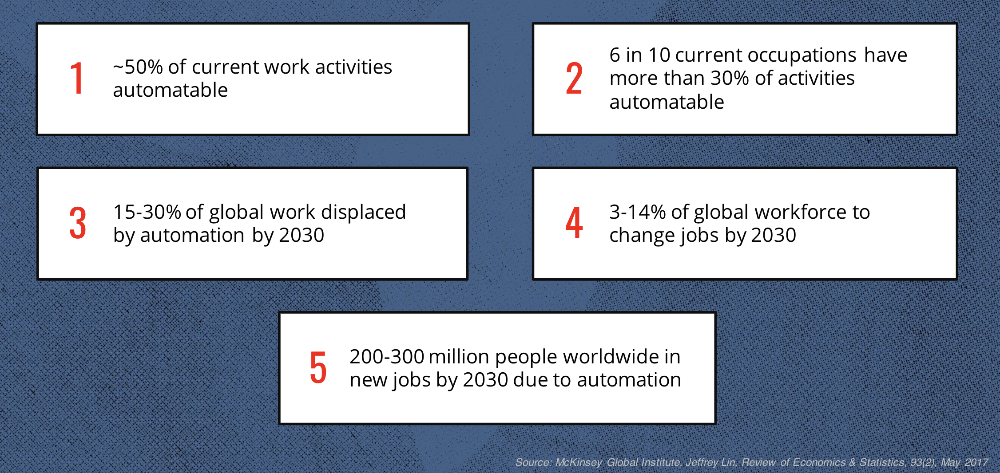
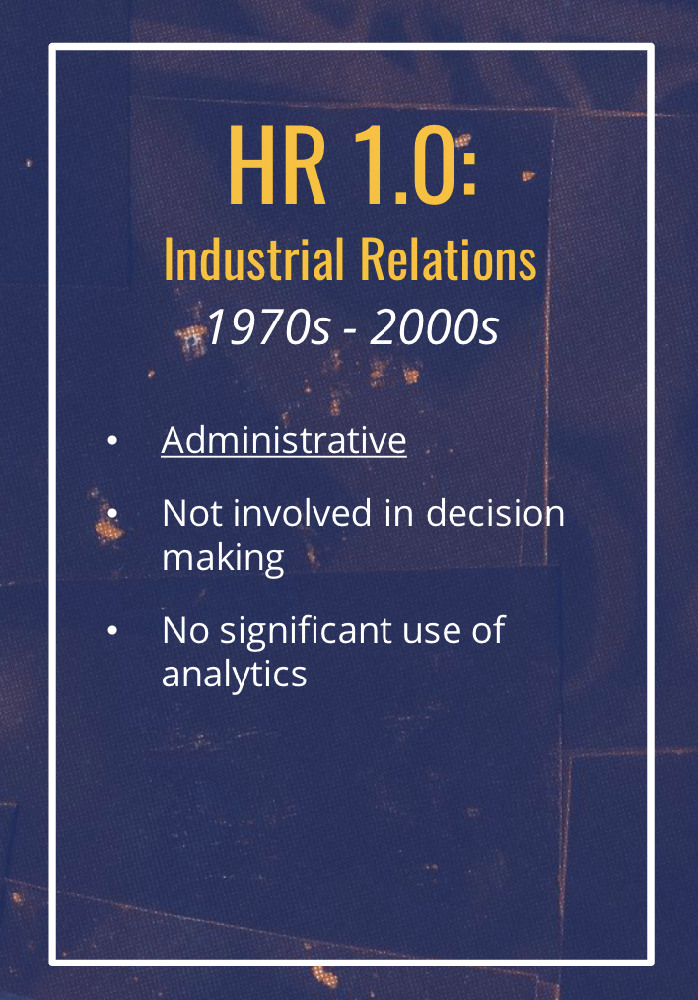
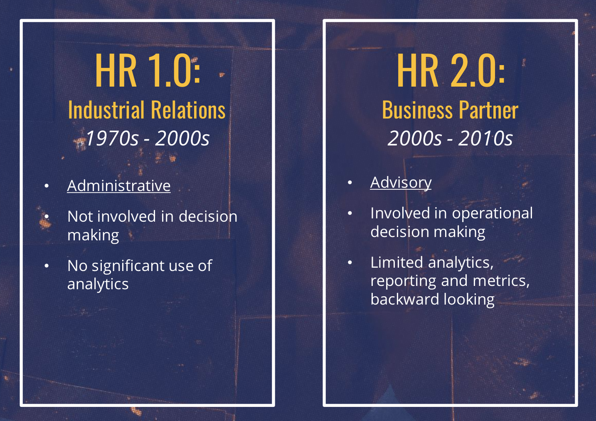
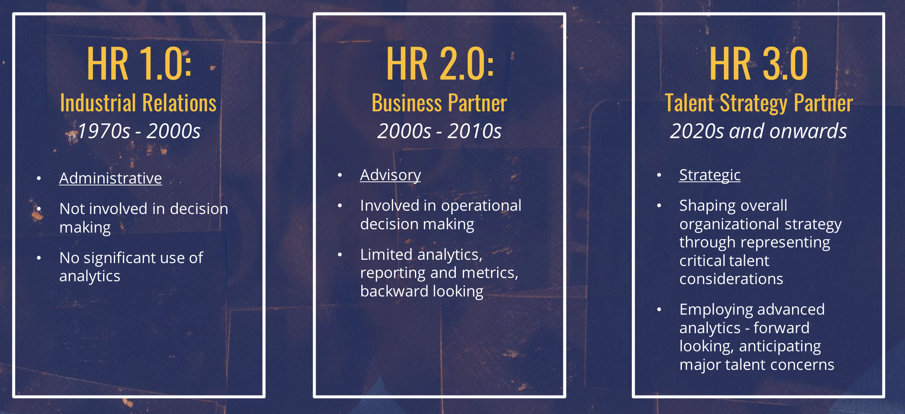
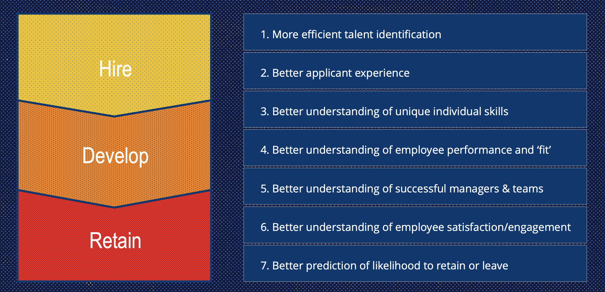
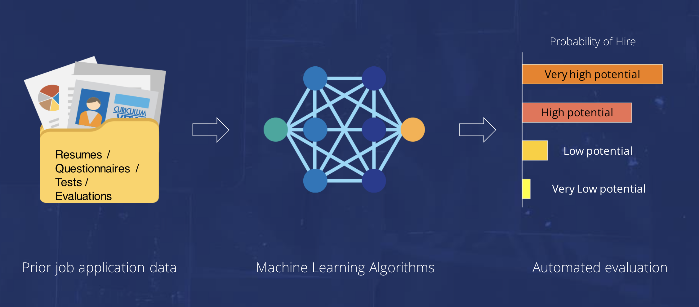

```{r setup, include=FALSE}
options(htmltools.dir.version = FALSE)
```


```{r xaringan-themer, include=FALSE}
library(xaringanthemer)
style_duo_accent(
  # primary_color = "#345865",
  primary_color = "#4B5263",
  secondary_color = "#2c90a6",
  black_color = "#4242424",
  white_color = "#FFF",
  base_font_size = "25px",
  text_font_family = "Roboto Slab",
  text_font_url = "https://indestructibletype.com/fonts/Jost.css",
  header_font_google = google_font("Roboto Slab", "400", "700"),
  header_font_weight = "400",
  inverse_header_color = "#eaeaea",
  title_slide_text_color = "#FFFFFF",
  text_slide_number_color = "#9a9a9a",
  text_bold_color = "#f79334",
  code_inline_color = "#B56B6F",
  link_color = "#2c8475",
  table_row_even_background_color = lighten_color("#345865", 0.9),
  extra_fonts = list(
    "https://indestructibletype.com/fonts/Jost.css",
    google_font("Amatic SC", "400")
  ),
  colors = c(
    green = "#31b09e",
    "green-dark" = "#2c8475",
    highlight = "#87f9bb",
    purple = "#887ba3",
    pink = "#B56B6F",
    orange = "#f79334",
    red = "#dc322f",
    `blue-dark` = "#002b36",
    `text-dark` = "#202020",
    `text-darkish` = "#424242",
    `text-mild` = "#606060",
    `text-light` = "#9a9a9a",
    `text-lightest` = "#eaeaea"
  ),
  extra_css = list(
    ".remark-slide-content h3" = list(
      "margin-bottom" = 0, 
      "margin-top" = 0
    ),
    ".smallish, .smallish .remark-code-line" = list(`font-size` = "0.9em")
  )
)
xaringanExtra::use_xaringan_extra(c("animate_css", "scribble"))
```

```{r metadata, echo=FALSE}
library(metathis)
meta() %>% 
  meta_description("Presented at the IPAC Conference July 26, 2021") %>% 
  meta_social(
    title = "Human Resources 3.0",
    url = "https://ipac.keithmcnulty.org",
    image = "https://ipac.keithmcnulty.org/cover.png",
    twitter_card_type = "summary_large_image",
    twitter_creator = "dr_keithmcnulty"
  )

```

```{r components, include=FALSE}
slides_from_images <- function(
  path,
  regexp = NULL,
  class = "hide-count",
  background_size = "contain",
  background_position = "top left"
) {
  if (isTRUE(getOption("slide_image_placeholder", FALSE))) {
    return(glue::glue("Slides to be generated from [{path}]({path})"))
  }
  if (fs::is_dir(path)) {
    imgs <- fs::dir_ls(path, regexp = regexp, type = "file", recurse = FALSE)
  } else if (all(fs::is_file(path) && fs::file_exists(path))) {
    imgs <- path
  } else {
    stop("path must be a directory or a vector of images")
  }
  imgs <- fs::path_rel(imgs, ".")
  breaks <- rep("\n---\n", length(imgs))
  breaks[length(breaks)] <- ""

  txt <- glue::glue("
  class: {class}
  background-image: url('{imgs}')
  background-size: {background_size}
  background-position: {background_position}
  {breaks}
  ")

  paste(txt, sep = "", collapse = "")
}
options("slide_image_placeholder" = FALSE)
```

class: left title-slide no-animation
background-image: url('nasa.jpg')
background-size: cover
background-position: top center

[medium-km]: https://keith-mcnulty.medium.com
[dr_km]: https://twitter.com/dr_keithmcnulty
[km]: https://www.linkedin.com/in/keith-mcnulty/

# Human Resources 3.0

.title-where[
IPAC Conference - July 26, 2021
]

```{css echo=FALSE}
@keyframes title-text{
    0% {
        opacity: 0;
        text-shadow: -20px 30px 5px rgba(0,0,0,0.25);
        transform: translate(15px, -15px);
    }
    10% {
        opacity: 0;
        text-shadow: -20px 30px 5px rgba(0,0,0,0.25);
        transform: translate(15px, -15px);
    }
    80% {
        opacity: 1;
        text-shadow: -5px 5px 10px rgba(0,0,0,0.25);
        transform: translate(0, 0);
    }
    100% {
        opacity: 1;
        text-shadow: -5px 5px 10px rgba(0,0,0,0.25);
        transform: translate(0, 0);
    }
}

@keyframes enter-right {
  0% {
    opacity: 0;
    transform: rotate(90deg) translateY(-50px)
  }
  20% {
    opacity: 0;
    transform: rotate(90deg) translateY(-50px)
  }
  80% {
    opacity: 1;
    transform: rotate(90deg) translateY(0)
  }
  100% {
    opacity: 1;
    transform: rotate(90deg) translateY(0)
  }
}

@keyframes enter-left {
  0% {
    opacity: 0;
    transform: translateY(100px)
  }
  20% {
    opacity: 0;
    transform: translateY(100px)
  }
  60% {
    opacity: 1;
    transform: translateX(0)
  }
  100% {
    opacity: 1;
    transform: translateX(0)
  }
}

.title-slide h1 {
	font-size: 100px;
	font-family: Jost, sans;
	animation-name: title-text;
	animation-duration: 13s;
	animation-direction: alternate;
	animation-iteration-count: infinite;
}

.side-text {
	color: white;
  opacity: 0.66;
	transform: rotate(90deg);
	position: absolute;
  font-size: 20px;
	top: 130px;
	right: -130px;
  transition: opacity 0.5s ease-in-out;
	animation-name: enter-right;
	animation-duration: 13s;
	animation-direction: alternate;
	animation-iteration-count: infinite;
}

.side-text:hover {
  opacity: 1;
}

.side-text a {
  color: white;
}

.title-where {
	color: white;
	font-family: Jost, sans;
	font-size: 40px;
	position: relative;
	top: -30px;
	animation-name: enter-left;
	animation-duration: 13s;
	animation-direction: alternate;
	animation-iteration-count: infinite;
  animation-timing-function: ease-in-out;
}
```

```{r echo = FALSE}
xaringanExtra::use_progress_bar(
  color = "blue",
  location = c("top", "bottom"),
  height = "0.25em"
)
```

---
class: center, middle

# &#128064; [https://ipac.keithmcnulty.org](https://ipac.keithmcnulty.org)

---
class: left, middle

```{r, echo = FALSE}
xaringanExtra::use_logo(
  image_url = "ipac.png"
)

xaringanExtra::use_animate_all("fade")


```

## Who am I and why am I here?

.f3[
&#x1F44B; Hi, I'm **Keith McNulty**.  I'm Director of Talent Science and Analytics at McKinsey & Company.
]

.f3[
&#128164; Originally a Pure Mathematician
]

.f3[
&#128170; Spent 10+ years working in Assessment
]

.f3[
&#129299; Now I apply statistics/data science in the people/HR space
]

.f3[
&#128571; Fascinated by people measurement and analytics 
]

.f3[
&#128483; Blogging/updates:  [LinkedIn][km] | [Twitter][dr_km] |  [Medium][medium-km]
]


---
class: left, middle

## What I want to talk about today

.f3[
&#129302; The historic nature of the times we are living in
]

.f3[
&#129302; The impact of this on HR
]

.f3[
&#129302; The rapidly changing world of Assessment
]

.f3[
&#129302; What this means for Assessment professionals
]


---
class: inverse, center, middle

# We are living through an historic disruption in the world of work


---
class: left, middle

## Back in time to the last major disruption

.pull-left[
</img>
]

.pull-right[
</img>
]

---
class: left, middle

## The UK 1770-1890

<center></img></center>

---
class: left, middle

## The United States 1895-2015

<center></img></center>


---
class: left, middle

## What happened in the mid-1970s?

<center></img></center>


---
class: left, middle

## Today, only 40 years later

<center><video height="450" controls="controls" preload="none" onclick="this.play()">
 <source type="video/webm" src="alibaba.mp4">
</video></center>


<center><audio id="myAudio" src="http://www.gstatic.com/b-g/KOK4HAMTAPH5Z96154F6GKUM74A3Z1576269077.mp3" preload="auto">
</audio>
<a onClick="togglePlay()" style="cursor:pointer;">&#9654; Listen to phone call</a></center>

<script type="text/javascript">
var myAudio = document.getElementById("myAudio");

function togglePlay() {
  return myAudio.paused ? myAudio.play() : myAudio.pause();
};
</script>

---
class: left, middle

## Profound shifts in jobs expected

<center></img></center>


---
class: inverse, center, middle

# There is an imperative and an opportunity for HR to up its game

---
class: left, middle

## HR can and must adapt

</img>

---
class: left, middle

## HR can and must adapt

</img>

---
class: left, middle

## HR can and must adapt

</img>


---
class: left, middle

## Analytics underpins HR 3.0

<center></img></center>


---
class: inverse, center, middle

# The world of assessment is developing at an unprecedented pace in the digital era


---
class: left, middle

## How will decisions be made?

<center></img></center>


---
class: left, middle

## How will testing develop? 

<center><video height="450" controls="controls" preload="none" onclick="this.play()">
 <source type="video/webm" src="gameclip.mp4">
</video></center>

---
class: left, middle

## How to keep up with it all?

.f3[
&#128165;  Automated video assessment/facial recognition 
]

.f3[
&#128165;  Natural Language Processing 
]

.f3[
&#128165;  The emergence of 'grit' as a construct
]

.f3[
&#128165;  Concerns about bias/fairness
]

.f3[
&#128165;  And so much more
]


---
class: inverse, center, middle

# The assessment profession has a critical role to play, but this requires a more analytically driven approach

---
class: left, middle

## Very important questions remain mostly unanswered 

.f3[
&#128533; Despite a lot of press, most technologies have yet to prove validity/fitness for purpose. PR is winning over science.
]

.f3[
&#128533; Risks to fairness/diversity a concern.
]

.f3[
&#128533; Applicant reactions/experience - particularly where poor face validity
]

.f3[
&#128533; Academic research is now behind the curve - innovation happening in enterprise settings
]


---
class: left, middle

## High analytic standards needed 

.f3[
&#129299; Require a high standard of data - don't take vendor's word for it
]

.f3[
&#129299; Be able to analyze and model the data
]

.f3[
&#129299; Analytically defend the key four pillars:  validity, fairness, efficiency, experience
]

.f3[
&#129299; Imperative to have analytic capabilities on teams
]


---
class: inverse, center, middle

# &#128591; Thank you!
